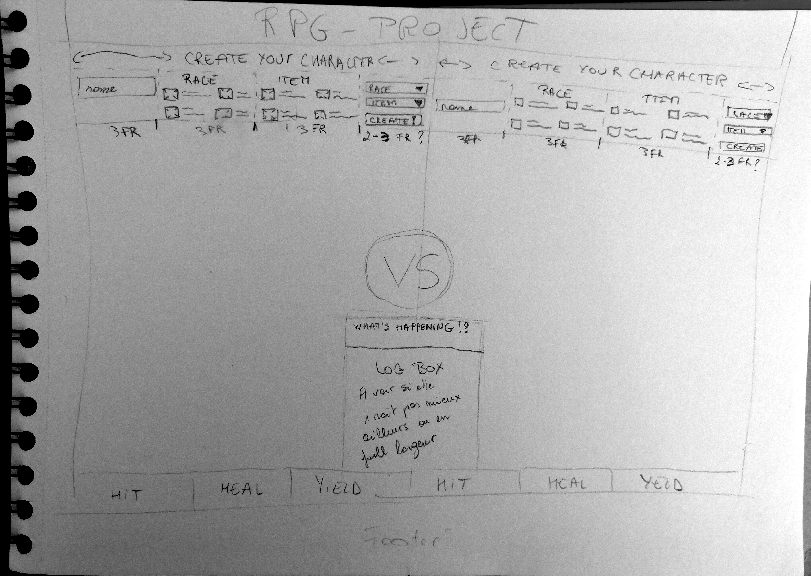

# 2. The Hill - RPG Project

## What!? 
JS-RPG is a consolidation project I want to finish during summer pasturages. It is a battle between 2 players where you can choose between 4 races and 4 items. You can attack the other player, heal yourself or be a caward and yield.    

- Here is the [Link to test my project](https://nathalie-anneessens.github.io/js-rpg/)  **WIP !**
- If you are a Becodian, you can read the briefing [here !](https://github.com/becodeorg/BXL-Swartz-4-27/tree/master/2.The-Hill/1.Javascript/rpg-project)

### Wireframe

### Design (not responsive at all)
*Screenshot comming soon*

### Features
#### **Journey 1**
- [x] Challenge 1.1: Create an HTML page with the following elements included:
  - [x] A title.
  - [x] An element to display both characters stats (visual, name, item, health...) Something like a VS screen
  - [x] A panel with 6 buttons, 3 for each player (hit, heal & yield. Those are the moves.)
  - [x] A creation panel with inputs & dropdowns to create your character. (For now only name, items and race )
  - [ ] A log that will tell you which move the player made.

- [x] Challenge 1.2: Use the character.js file and save the inputs inside variables/an object, and use them to initiate new characters for both players.
- [x] Challenge 1.3: Make sure that only the title, VS screen and the input field are visible when creating the characters.
- [x] Challenge 1.4: When the characters are created, the creation panel should disappear. After this, the moves & log panel should appear.
- [x] Challenge 1.5: Display the health bar of both players this should work real-time. Make sure it has a decrease/increase animation Make use of max-health and currentHealth.  
#### **Journey 2**
- [x] Challenge 2.1: Create a js file named gamelogic.js. You are in charge of writing the game itself. Take a look at the character.js file you will have to use it.  
*Note: You will have to work with this file as well. Its up to you to find out what belongs where.*

- [x] Challenge 2.2: Initiate a temporary character. We will use this to test our game logic.
- [x] Challenge 2.3: Write a function that will handle the races. ~~This will only run once.~~
- [x] Challenge 2.4: Write a function that will handle the items. ~~This will be called everytime we make a move.~~
- [x] Challenge 2.5: Make the functions work with the character. See if the stats change on creation.
- [x] Challenge 2.6: Lower the health of your object and create a healing function that will use the heal function. (character.js) Make it so the function uses a random number between the minHealing and maxHealing.  
*Note: The currentHealth should NEVER go above the maxHealth*
#### **The Boss**
- [x] Combine the code + html for some 'working result'.
- [x] Inputs should generate the characters stats.
- [ ] Work out the attack function (Almost the same as heal but it has to hit the enemy).
- [x] When a player loses, display a victory message & a loose message for each player. 
- [ ] At the end of the game, you should be able to restart the game to create a new character.

## How!?
By using VSCode, HTML5, CSS3 Javascript Vanilla and YouTube for a great epic sound ambiance.  

## Who!?
I worked alone on this project, but I also ask some help to my collegues. 

## When!?
We start this project in february... 
(You can find my messy organization [here](organisation.md) in french...)

I was not able to success before we begin to learn an other language, so now, I want to...  !  

## Where!?
Now, I am working on the readme from my bed... On the other days I worked from my living-room who is also my pseudo-work office. 

