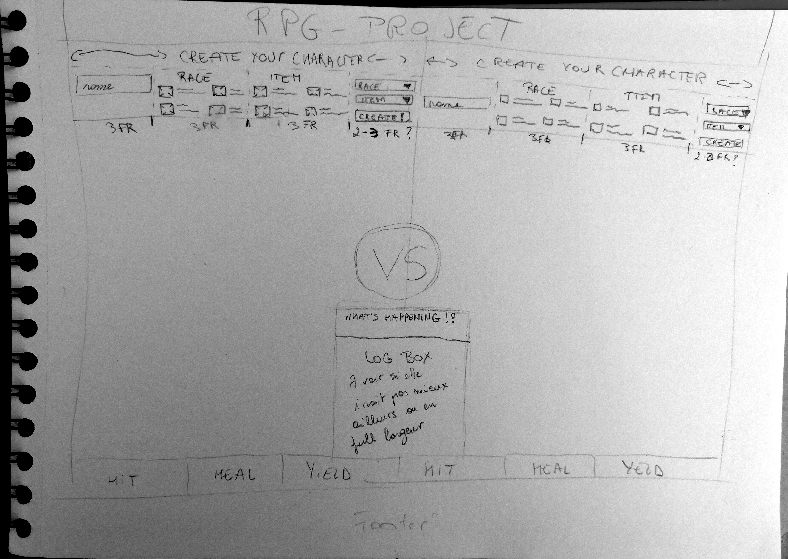

# 2. The Hill - RPG Project
## Informations utiles
### Liens utiles
~~[Lien du projet](#)~~  **WIP !**

[Lien des consignes](https://github.com/becodeorg/BXL-Swartz-4-27/tree/master/2.The-Hill/1.Javascript/rpg-project)

---

### Deadline
15/03/2020 à 09h00

---
## Maquette

## Organisation
### Lundi 22/02
- [x] Créer le repo, cloner sur mon pc et pusher les premiers fichiers
- [x] Lire le briefing
- [ ] Ne pas paniquer parce qu'on est qu'aux tableaux en JS et qu'on a rien vu sur les objets ni le DOM... :thinking:
- [x] Installer les addons utiles de l'[article découvert ce week-end](https://dev.to/ratuloss/my-productivity-setup-vs-code-4o9d)... Ca a pris plus de temps que prévu.  
- [x] Commencer [Player 1 - Challenge 1](#challenge-1)

### 23/02
- [x] Faire une maquette papier pour voir clairement ce qu'il faut comme contenu sur la page html et ne pas coder à l'aveugle
- [x] ~~Finir~~ Continuer [Player 1 - Challenge 1](#challenge-1)
### 24/02
**AM**
- [x] **FINIR** [Player 1 - Challenge 1](#challenge-1)... C'est pas tip-top-moumoute mais on s'en contentera. 

**PM**
- [ ] Ne pas paniquer devant le passage au JS
- [ ] Parcourir la matière théorique des exos du JS

### 25/02
- [x] Faire [Player 1 - Challenge 2](#challenge-2)
- [x] Faire [Player 1 - Challenge 3](#challenge-3)
- [x] Faire [Player 1 - Challenge 4](#challenge-4)

### 26/02
- [ ] Faire [Player 1 - Challenge 5](#challenge-5)
- [ ] Trouver un moyen d'afficher l'avatar  
---

## Process pour s'organiser par rapport à ca (trouver comme les coachs ont fait pour masquer certains elements dans leur readme !)
### Player 1
#### **Challenge 1:**  
Create an HTML page with the following elements included:

- A title.
- An element to display both characters stats (visual, name, item, health...) - Something like a VS screen
- A panel with 6 buttons, 3 for each player (hit, heal & yield. Those are the moves.)
- A creation panel with inputs & dropdowns to create your character. (For now only name, items and race )
- A log that will tell you which move the player made.

#### **Challenge 2:**
Use the character.js file and save the inputs inside variables/an object, and use them to initiate new characters for both players.

#### **Challenge 3:**
Make sure that only the title, VS screen and the input field are visible when creating the characters.

#### **Challenge 4:**
When the characters are created, the creation panel should disappear. After this, the moves & log panel should appear.

#### **Challenge 5:**
Display the health bar of both players this should work real-time. Make sure it has a decrease/increase animation Make use of max-health and currentHealth.

---

### Player 2
#### **Challenge 1:**
Create a js file named gamelogic.js. You are in charge of writing the game itself. Take a look at the character.js file you will have to use it.

Note: You will have to work with this file as well. Its up to you to find out what belongs where.

#### **Challenge 2:**
Initiate a temporary character. We will use this to test our game logic.

#### **Challenge 3:**
Write a function that will handle the races. This will only run once.

#### **Challenge 4:**
Write a function that will handle the items. This will be called everytime we make a move.

#### **Challenge 5:**
Make the functions work with the character. See if the stats change on creation.

#### **Challenge 6:**
Lower the health of your object and create a healing function that will use the heal function. (character.js) Make it so the function uses a random number between the minHealing and maxHealing.

Note: The currentHealth should NEVER go above the maxHealth

---

